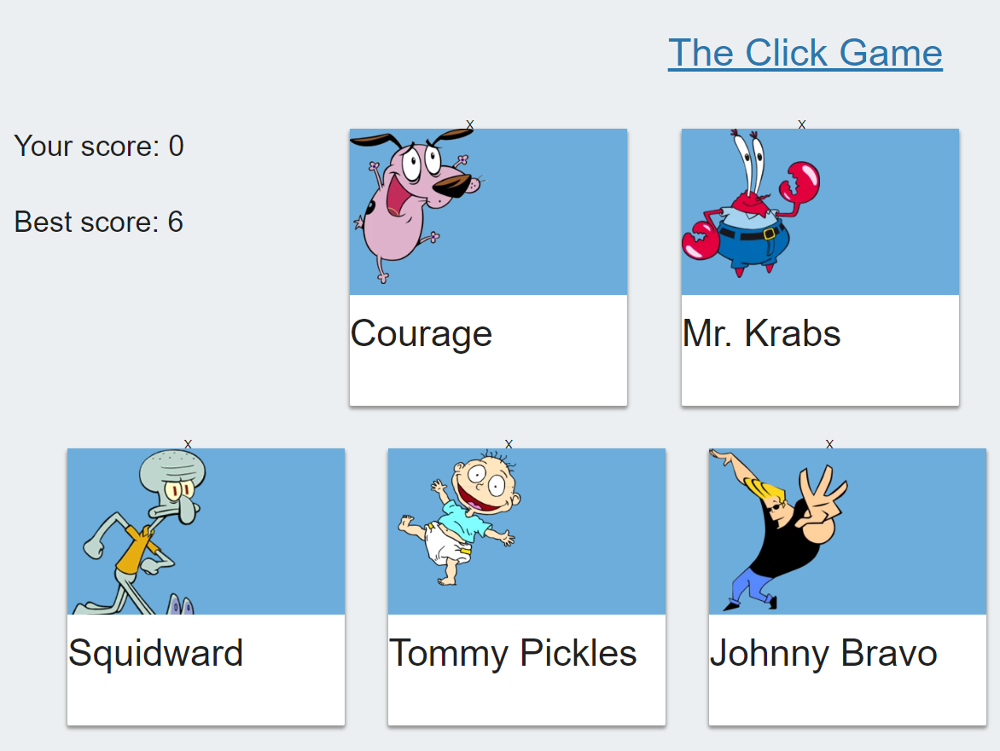

# ProPublica Scrapper [](https://travis-ci.org/npm/npm) [](https://www.npmjs.com/package/npm) [](http://makeapullrequest.com) [](https://github.com/your/your-project/blob/master/LICENSE)
 This app uses React.js front-end framework to render content
 using JSX. This content is rerendered with each change of state. 

## Problem solved
1. Isolation of web component dutys. 
2. Handling data, and rerendering of page when state changes. 

## Deployed Site

[Deployed App](https://dashboard.heroku.com/apps)

# Tools
- React.js
- Heroku
- GitHub
- DocToc (Table of Contents)
- Materialize

<!-- START doctoc generated TOC please keep comment here to allow auto update -->
<!-- DON'T EDIT THIS SECTION, INSTEAD RE-RUN doctoc TO UPDATE -->
**Table of Contents**  *generated with [DocToc](https://github.com/thlorenz/doctoc)*
- [Frontend](#Frontend)
  - [Materialize](https://materializecss.com/)
  - [React.js](https://jquery.com/)

- [Development Tools](#development-tools)
  - [Heroku](https://www.heroku.com/)
  - [GitHub](https://github.com/JasonRobnson)
  - [DocToc](https://github.com/thlorenz/doctoc)

<!-- END doctoc generated TOC please keep comment here to allow auto update -->


## Folder Structure

After creation, your project should look like this:

```
my-app/
  README.md
  node_modules/
  package.json
  public/
    index.html
    favicon.ico
  src/
    App.css
    App.js
    App.test.js
    index.css
    index.js
    logo.svg
```


### commands

- `nodemon server.js || node server.js`: will get the app up and running after all dependencies are installed.

## Database

MongoDB is used as the database for this project. 

